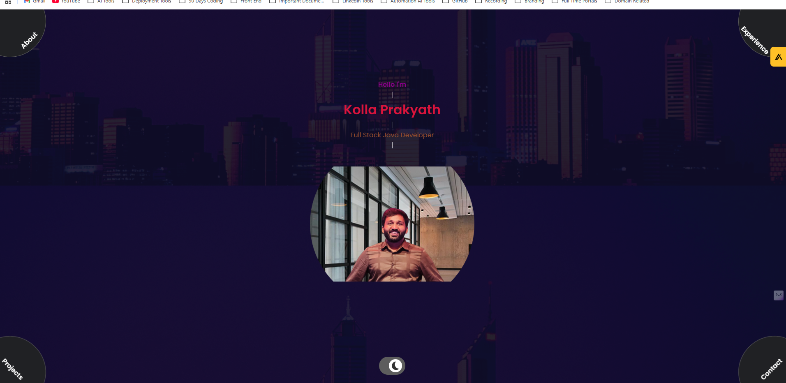

# Portfolio Website

Welcome to my personal portfolio website! This project showcases my professional journey, skills, and notable projects in an engaging and interactive way. It's designed to give potential employers, collaborators, and visitors an insight into my work, expertise, and interests.

## 🔗 Live Demo

[Visit Portfolio Website](https://kollaprakyath.dev)

---

## 📂 Project Structure

The portfolio is a single-page application (SPA) built with modern web technologies to ensure a smooth user experience. Below is an overview of the structure:

- **Hero Section:** Dynamic greeting and animated introduction.
- **About Section:** Details about my resume, experience, and education.
- **Experience Section:** Highlights frontend and backend skills with icons.
- **Projects Section:** Displays my key projects with links to demos and GitHub repositories.
- **Contact Section:** Easy access to my email, LinkedIn, and GitHub profiles.

---

## 🛠️ Technologies Used

- **Frontend:**
  - HTML5
  - CSS3 (including custom animations)
  - JavaScript (Typed.js for dynamic typing effects)

- **Design and Assets:**
  - Icons and illustrations for visual engagement.
  - Responsive design for optimal viewing on devices of all sizes.

---

## 🚀 Features

- **Interactive Animations:** Eye-catching animations for an engaging user experience.
- **Responsive Design:** Optimized for both desktop and mobile devices.
- **Dark/Light Mode:** Toggle between themes to match user preferences.
- **Project Showcase:** Includes links to live demos and source code for my featured projects.
- **Contact Information:** Easy-to-access buttons for email, LinkedIn, and GitHub.

---

## 📸 Preview

---
## License

This project is licensed under the MIT License - see the [LICENSE](LICENSE) file for details.

